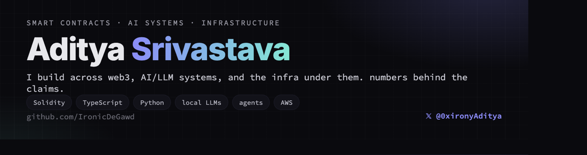

  

  
  

## What I build

- **Smart contracts & on-chain systems.** Solidity with gas measured in CI, native event-driven execution, prediction-market and trading primitives.
- **AI / LLM systems.** Calibrated probability models as decision engines, agentic loops, and self-hosted local-LLM serving with real benchmarks.
- **Infrastructure.** Trading bots, faucets, and ephemeral CI runner farms on AWS; Redis queues, Docker, and the plumbing that keeps it live.
- **Measured claims only.** If something says *fast* or *cheap*, there is a number and a reproducer behind it.

## Recent public work

- **[somnia-vs-keeper-loop](https://github.com/IronicDeGawd/somnia-vs-keeper-loop):** the same contract reacting to an on-chain event across 8 EVM chains, live on testnet. Native reactivity vs the off-chain keeper loop.
- **[EthOnline2026-Amulet](https://github.com/IronicDeGawd/EthOnline2026-Amulet):** a wearable pendant that is the only device allowed to carry a transaction to your Ledger. *(ETHOnline 2026: Ledger, The Graph, ENS.)*
- **[ec-dreamdex-hackathon-template](https://github.com/IronicDeGawd/ec-dreamdex-hackathon-template):** a minimal, anti-spoonfeed starter for on-chain binary prediction markets.

## Tech

## GitHub

  

  
  

  
  

  

